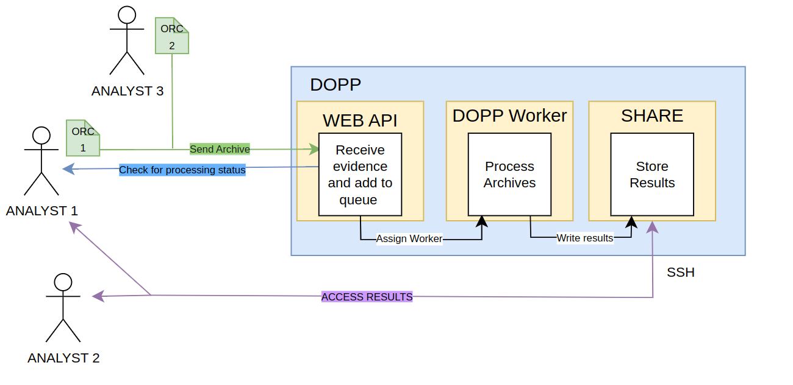
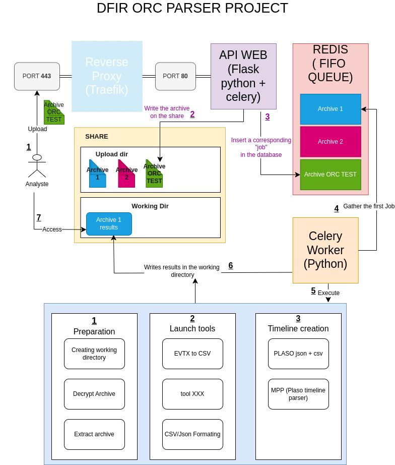

# Dfir ORC Parser Project


To have more info about DOPP:

* How to install DOPP, tutorial [here](https://youhgo.github.io/DOPP-how-to-install-EN/)
* How to use DOPP, tutorial [here](https://youhgo.github.io/DOPP-how-to-use-EN/)
* DOPP result architecture, explained [here](https://youhgo.github.io/DOPP-Results/)

The [DFIR-ORC](https://github.com/dfir-orc) config file that i use is available [here](./ressources/DFIR-ORC_config.xml)

Setup ORC with my config, tutorial [here]()

## What is DOPP ?

The purpose of DOPP is to provide the necessary tools for parsing Windows artifacts (event logs, MFT, registry hives, amcache, etc.) as part of a digital forensics investigation.
Dopp produces extremely simple and readable results, allowing analysts to find the information they need directly.

Dopp was designed to process archives provided by the [DFIR-ORC](https://github.com/dfir-orc) collection tool from ANSSI but will be compatible with all formats soon.

DOPP is:

* Fast: ~5 minutes to process a 500MB archive (excluding PLASO);
* Easily installable with Docker;
* Simple to use.

The tool contain a web server with an API for sending archive and consulting the status of processing.

There is NO Web or GUI interface to see the results.
All the results are CSV files formated to be easy to read and to GREP.
Json output is also possible for SIEM ingestion.

This architecture is perfect for teamwork because it regroups all the tools and evidences.
Any analyst can send evidence for processing or access their results as long as they have access to the api for sending
and to the share result folder for consulting.



## What does DOPP do ?

DOPP Will : 
* Process a DFIR ORC Archive;
* Parse the evidences;
* Create a Timeline.

All the results are formated in a human-readable way : 

```bash
4624.csv :
Date|time|event_code|subject_user_name|target_user_name|ip_address|ip_port|logon_type
2022-10-27|09:56:01|4624|DESKTOP-9I162HO$|Système|-|-|5
2022-10-27|09:56:06|4624|DESKTOP-9I162HO$|HRO|192.168.10.102|3389|10

Windefender.csv :
Date|time|EventCode|ThreatName|Severity|User|ProcessName|Path|Action
2021-01-07|03:35:44|1116 - Detection|HackTool:Win64/Mikatz!dha|High|BROCELIANDE\arthur|C:\Users\Public\beacon.exe|Not Applicable
2021-01-07|03:35:46|1116 - Detection|Behavior:Win32/Atosev.D!sms|Severe|-|C:\Users\Public\beacon.exe|Not Applicable
2021-01-07|03:35:46|1117 - Action|Behavior:Win32/Atosev.D!sms|Severe|-|C:\Users\Public\beacon.exe|Remove

App_Compat_cache.csv :
Date|Time|Name|FullPath|Hash
2021-01-07|03:39:31|beacon.exe|C:\Users\Public\beacon.exe|e55e5b02ad40e9846a3cd83b00eec225fb98781c6f58a19697bf66a586f77672
2021-01-07|03:41:21|mimikatz.exe|C:\Users\Public\mimikatz.exe|e55e5b02ad40e9846a3cd83b00eec225fb98781c6f58a19697bf66a586f77672
2021-01-07|03:56:55|Bytelocker.exe|C:\Users\Public\Bytelocker.exe|e55e5b02ad40e9846a3cd83b00eec225fb98781c6f58a19697bf66a586f77672
2021-01-07|04:19:41|ActiveDirectorySync.exe|C:\Users\Administrator\Documents\ActiveDirectorySync.exe|e55e5b02ad40e9846a3cd83b00eec225fb98781c6f58a19697bf66a586f77672
```


Dopp uses externals tools listed here :

* [SRUM PARSER](https://github.com/MarkBaggett/srum-dump)
* [PREFETCH PARSER](http://www.505forensics.com)
* [PLASO](https://github.com/log2timeline/plaso)
* [EVTX DUMP](https://github.com/0xrawsec/golang-evtx)
* [ESE-analyst](https://github.com/MarkBaggett/ese-analyst)
* [analyzeMFT](https://github.com/rowingdude/analyzeMFT)
* [RegRipper](https://github.com/keydet89/RegRipper3.0)
* [MaximumPlasoParser](https://github.com/Xbloro/maximumPlasoTimelineParser)

## How to ?
* How to install -> [here](./ressources/documentation/how_to_install.md)
* How to use -> [here](./ressources/documentation/how_to_use.md)


## How does it work ?


Everything is dockerized.

Container used are :

- Traefik as a reverse proxy;
- redis as a broker;
- Flask + Celery as the API server / broker workers;
- Dopp engine as the main working code.

Everything is enclosed to the docker-compose.yml and Dockerfile


